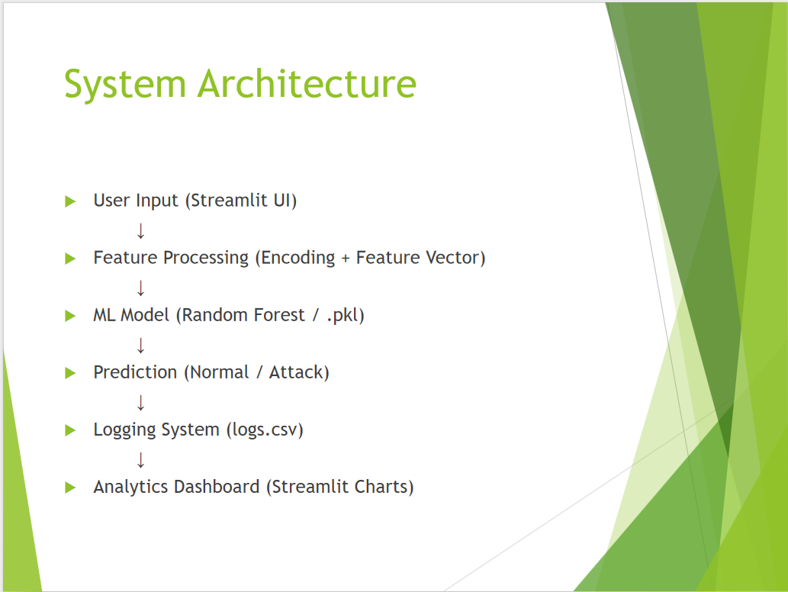

# 🔐 AI Network Intrusion Detection System


## Overview

An AI-powered Network Intrusion Detection System (NIDS) developed using Machine Learning and the NSL-KDD dataset.

The system analyzes network traffic features and predicts whether traffic is normal or malicious through an interactive dashboard.

---

## Features

✅ Intrusion Detection using Machine Learning

✅ Real-Time Prediction Dashboard

✅ Security Analytics

✅ Attack Logging System

✅ Confidence Score Estimation

✅ Streamlit Web Interface

---

## System Architecture




## Dashboard

### Main Dashboard


### Prediction Example


### Analytics


---

## Dataset

NSL-KDD Dataset

Network traffic features:
- Protocol Type
- Service
- Connection Flags
- Source Bytes
- Destination Bytes
- Connection Counts
- Many additional security indicators

---

## Technologies Used

- Python
- Streamlit
- Scikit-Learn
- Pandas
- NumPy
- Joblib

---

## Installation

```bash
pip install -r requirements.txt
```

Run:

```bash
streamlit run app/app.py
```

## Results

Model Accuracy:

```text
99.86%
```

## Future Work

- Deep Learning Models
- Real-Time Packet Capture
- Cloud Deployment
- Explainable AI (XAI)
- SOC Dashboard Integration

## Author

Fatima Hameed
